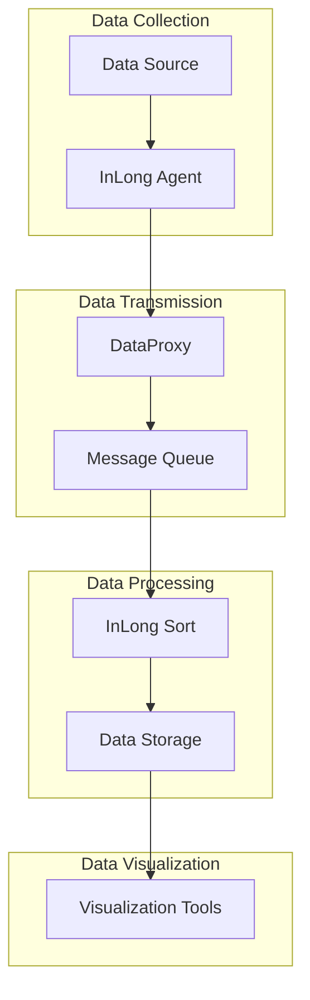

# Apache InLong Connection Steps

This guide provides detailed steps for connecting the various components in an Apache InLong data pipeline. It covers both our Docker Compose demo setup and a production deployment.

## Connection Overview



## 1. Connecting Data Sources to InLong Agent

### File-based Sources

```json
{
  "source": {
    "type": "file",
    "path": "/path/to/data/files",
    "pattern": "*.json",
    "timeOffset": 0,
    "collectInterval": 3000
  },
  "sink": {
    "type": "dataproxy",
    "dataProxyUrl": "http://dataproxy:5000/api/data"
  }
}
```

### Database Sources

```json
{
  "source": {
    "type": "mysql",
    "hostname": "mysql-host",
    "port": 3306,
    "username": "root",
    "password": "password",
    "database": "test_db",
    "table": "user_behavior",
    "primaryKey": "id",
    "interval": 60000
  },
  "sink": {
    "type": "dataproxy",
    "dataProxyUrl": "http://dataproxy:5000/api/data"
  }
}
```

### API Sources

```json
{
  "source": {
    "type": "http",
    "url": "http://api-endpoint/data",
    "method": "GET",
    "headers": {
      "Authorization": "Bearer token"
    },
    "interval": 60000
  },
  "sink": {
    "type": "dataproxy",
    "dataProxyUrl": "http://dataproxy:5000/api/data"
  }
}
```

## 2. Connecting InLong Agent to DataProxy

### HTTP Connection

```properties
# Agent configuration
agent.local.ip=192.168.1.100
agent.http.port=8008

# DataProxy endpoint
agent.dataproxy.url=http://dataproxy:5000/api/data
agent.dataproxy.timeout=5000
agent.dataproxy.retryTimes=3
```

### Authentication

```properties
# Basic authentication
agent.dataproxy.auth.type=basic
agent.dataproxy.auth.username=user
agent.dataproxy.auth.password=password

# Token authentication
agent.dataproxy.auth.type=token
agent.dataproxy.auth.token=your-auth-token
```

## 3. Connecting DataProxy to Message Queue

### Kafka Connection

```properties
# Kafka configuration
dataproxy.kafka.bootstrap.servers=kafka:9092
dataproxy.kafka.topic.name=user_behavior
dataproxy.kafka.producer.acks=all
dataproxy.kafka.producer.retries=3
dataproxy.kafka.producer.batch.size=16384
dataproxy.kafka.producer.linger.ms=1
```

### Pulsar Connection

```properties
# Pulsar configuration
dataproxy.pulsar.service.url=pulsar://pulsar:6650
dataproxy.pulsar.admin.url=http://pulsar:8080
dataproxy.pulsar.topic.name=persistent://public/default/user_behavior
dataproxy.pulsar.producer.sendTimeout=30000
dataproxy.pulsar.producer.blockIfQueueFull=true
```

## 4. Connecting Message Queue to InLong Sort

### Kafka Consumer Configuration

```properties
# Kafka consumer configuration
sort.consumer.type=kafka
sort.consumer.kafka.bootstrap.servers=kafka:9092
sort.consumer.kafka.group.id=inlong-sort
sort.consumer.kafka.auto.offset.reset=earliest
sort.consumer.kafka.enable.auto.commit=false
```

### Pulsar Consumer Configuration

```properties
# Pulsar consumer configuration
sort.consumer.type=pulsar
sort.consumer.pulsar.service.url=pulsar://pulsar:6650
sort.consumer.pulsar.admin.url=http://pulsar:8080
sort.consumer.pulsar.subscription.name=inlong-sort
```

## 5. Connecting InLong Sort to Data Storage

### Elasticsearch Connection

```properties
# Elasticsearch configuration
sort.sink.type=elasticsearch
sort.sink.elasticsearch.hosts=elasticsearch:9200
sort.sink.elasticsearch.index=user_behavior
sort.sink.elasticsearch.username=elastic
sort.sink.elasticsearch.password=password
sort.sink.elasticsearch.bulk.actions=1000
sort.sink.elasticsearch.bulk.size.mb=5
sort.sink.elasticsearch.bulk.flush.interval=1000
```

### ClickHouse Connection

```properties
# ClickHouse configuration
sort.sink.type=clickhouse
sort.sink.clickhouse.url=jdbc:clickhouse://clickhouse:8123/default
sort.sink.clickhouse.username=default
sort.sink.clickhouse.password=password
sort.sink.clickhouse.table=user_behavior
sort.sink.clickhouse.batch.size=1000
```

## 6. Connecting Data Storage to Visualization Tools

### Kibana with Elasticsearch

1. Access Kibana at http://localhost:5601
2. Navigate to Stack Management > Index Patterns
3. Create a new index pattern:
   - Index pattern: `user_behavior*`
   - Time field: `timestamp`
4. Create visualizations and dashboards:
   - Discover: Explore raw data
   - Visualize: Create charts and graphs
   - Dashboard: Combine visualizations

### Grafana with ClickHouse

1. Access Grafana at http://localhost:3000
2. Add ClickHouse as a data source:
   - Name: ClickHouse
   - Type: ClickHouse
   - URL: http://clickhouse:8123
   - Database: default
   - Username: default
   - Password: password
3. Create dashboards using ClickHouse SQL queries

## Connection Troubleshooting

### Network Connectivity

```bash
# Test connectivity between components
ping dataproxy
telnet kafka 9092
curl -v http://elasticsearch:9200
```

### Authentication Issues

```bash
# Test DataProxy authentication
curl -v -u username:password http://dataproxy:5000/health

# Test Elasticsearch authentication
curl -v -u elastic:password http://elasticsearch:9200
```

### Message Queue Issues

```bash
# List Kafka topics
kafka-topics.sh --bootstrap-server kafka:9092 --list

# Consume messages from Kafka topic
kafka-console-consumer.sh --bootstrap-server kafka:9092 --topic user_behavior --from-beginning
```

### Data Storage Issues

```bash
# Check Elasticsearch indices
curl -X GET "http://elasticsearch:9200/_cat/indices?v"

# Check ClickHouse tables
clickhouse-client --host clickhouse --query "SHOW TABLES"
```

## Security Considerations

### Secure Connections

- Use HTTPS for all HTTP connections
- Enable TLS for Kafka and Pulsar
- Use encrypted connections for databases

### Authentication

- Implement authentication for all component connections
- Use strong passwords and rotate them regularly
- Consider using OAuth or SAML for web interfaces

### Authorization

- Implement role-based access control
- Restrict access to sensitive data
- Audit access to data and configurations

## Monitoring Connections

### Health Checks

```bash
# DataProxy health check
curl http://dataproxy:5000/health

# Elasticsearch health check
curl http://elasticsearch:9200/_cluster/health

# Kafka health check
kafka-topics.sh --bootstrap-server kafka:9092 --describe --topic user_behavior
```

### Metrics Collection

- Use Prometheus for metrics collection
- Monitor connection latency and throughput
- Set up alerts for connection failures

### Log Monitoring

- Centralize logs with ELK stack or similar
- Monitor for connection errors and warnings
- Set up log-based alerts for critical issues
