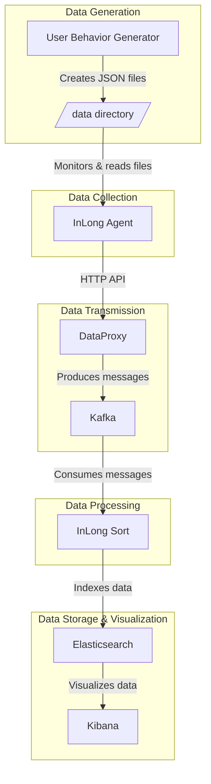
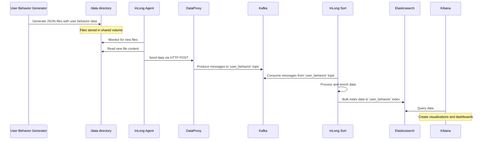
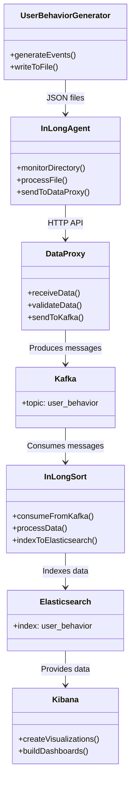

# Apache InLong Data Flow Diagram

## System Architecture Overview

```mermaid
flowchart TD
    subgraph "Data Generation"
        A[User Behavior Generator] -->|Creates JSON files| B[/data directory/]
    end
    
    subgraph "Data Collection"
        B -->|Monitors & reads files| C[InLong Agent]
    end
    
    subgraph "Data Transmission"
        C -->|HTTP API| D[DataProxy]
        D -->|Produces messages| E[Kafka]
    end
    
    subgraph "Data Processing"
        E -->|Consumes messages| F[InLong Sort]
    end
    
    subgraph "Data Storage & Visualization"
        F -->|Indexes data| G[Elasticsearch]
        G -->|Visualizes data| H[Kibana]
    end
```

## Detailed Process Flow

```mermaid
sequenceDiagram
    participant UBG as User Behavior Generator
    participant Data as /data directory
    participant Agent as InLong Agent
    participant Proxy as DataProxy
    participant Kafka as Kafka
    participant Sort as InLong Sort
    participant ES as Elasticsearch
    participant Kibana as Kibana

    UBG->>Data: Generate JSON files with user behavior data
    Note over Data: Files stored in shared volume
    Agent->>Data: Monitor for new files
    Agent->>Data: Read new file content
    Agent->>Proxy: Send data via HTTP POST
    Proxy->>Kafka: Produce messages to 'user_behavior' topic
    Sort->>Kafka: Consume messages from 'user_behavior' topic
    Sort->>Sort: Process and enrich data
    Sort->>ES: Bulk index data to 'user_behavior' index
    Kibana->>ES: Query data
    Note over Kibana: Create visualizations and dashboards
```

## Component Interaction Model

```mermaid
classDiagram
    class UserBehaviorGenerator {
        +generateEvents()
        +writeToFile()
    }
    
    class InLongAgent {
        +monitorDirectory()
        +processFile()
        +sendToDataProxy()
    }
    
    class DataProxy {
        +receiveData()
        +validateData()
        +sendToKafka()
    }
    
    class Kafka {
        +topic: user_behavior
    }
    
    class InLongSort {
        +consumeFromKafka()
        +processData()
        +indexToElasticsearch()
    }
    
    class Elasticsearch {
        +index: user_behavior
    }
    
    class Kibana {
        +createVisualizations()
        +buildDashboards()
    }
    
    UserBehaviorGenerator --> InLongAgent: JSON files
    InLongAgent --> DataProxy: HTTP API
    DataProxy --> Kafka: Produces messages
    Kafka --> InLongSort: Consumes messages
    InLongSort --> Elasticsearch: Indexes data
    Elasticsearch --> Kibana: Provides data
```
